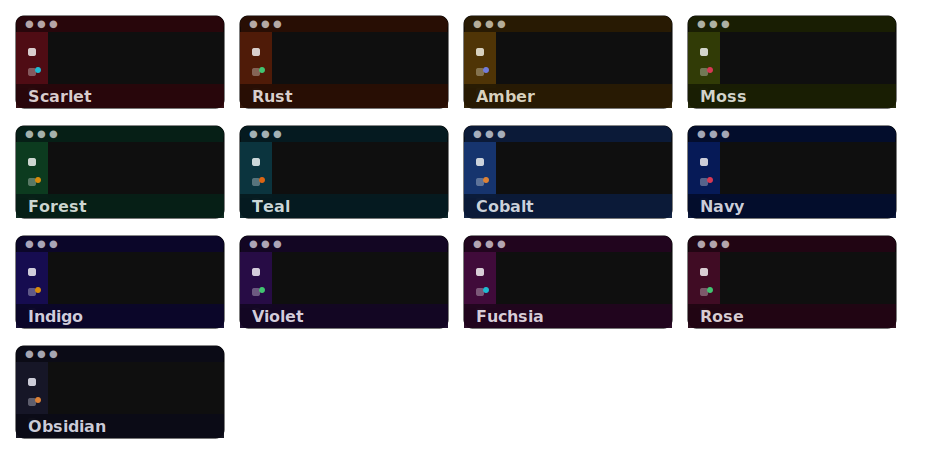

# Inky - experimental

Per-workspace color themes stored outside your repo or global user settings, synced across devices using [**Settings Sync**](https://code.visualstudio.com/docs/configure/settings-sync) and [`globalState`](https://code.visualstudio.com/docs/configure/settings-sync#_sync-user-global-state-between-machines).

## Why

Because `.vscode/settings.json` gets committed and shared with everyone else working in the repo.

All the other extensions that try to solve this problem do the same thing — they write theme colors into the workspace/user settings.

**Inky** keeps **mappings** and **theme definitions** in `globalState`, synced across devices via Settings Sync.

No theme data is ever committed to your repository. Colors are applied to your profile's settings on open and removed cleanly when cleared.

## Commands

| Command                                      | What it does                                                                                      |
| -------------------------------------------- | ------------------------------------------------------------------------------------------------- |
| `Inky: Set theme for this workspace`         | Pick a built-in or custom theme (with live preview), or save current colors as a new custom theme |
| `Inky: Edit custom themes file`              | Open `themes.json` directly in the editor for manual editing                                      |
| `Inky: Clear theme for this workspace`       | Remove the theme mapping and clear Inky-applied colors                                            |
| `Inky: List / manage all workspace themes`   | See every saved mapping, remove any entry                                                         |
| `Inky: Debug — dump global state to console` | Print mappings, custom themes, and file path to Developer Tools console                           |
| `Inky: Reset — clear ALL saved data`         | Wipe all mappings, custom themes file, and applied colors (with confirmation)                     |

Open the command palette (`Ctrl+Shift+P` / `Cmd+Shift+P`) and type `Inky`.

## Configuration

Configure under **Settings → Inky**:

| Setting                            | Type    | Default | Description                                                                                                                           |
| ---------------------------------- | ------- | ------- | ------------------------------------------------------------------------------------------------------------------------------------- |
| `inky.logging`                     | boolean | `false` | Enable the Inky output channel for diagnostics. When disabled, no channel is created and nothing is logged. Takes effect immediately. |
| `inky.syncPolling.enabled`         | boolean | `true`  | Poll `globalState` for Settings Sync changes from other machines. Disable if you only use one machine or prefer restart-based sync.   |
| `inky.syncPolling.intervalSeconds` | number  | `60`    | How often (in seconds) to check for Settings Sync updates from other machines. Only applies when polling is enabled. Range: 5–3600.   |

## Themes

### Built-in themes
<!-- VSC Marketplace -->
<!--  -->

### Custom themes

Custom themes live in a JSON file at `globalStorageUri/themes.json` — profile-independent and editable:

1. **Save from current colors:** Use `Inky: Set theme` → `Save current colors as custom theme…`
2. **Edit manually:** Use `Inky: Edit custom themes file` (or the edit option in the picker). The file opens in VS Code — edit hex values, add entries, save. Changes to the active theme are applied live via a file watcher.

## How it works

- **Workspace→theme** mappings are stored as `folder name → theme ID` references (e.g. `builtin:Plum`, `custom:My Navy`) — not color copies. The folder name (not full path) is used as the key so mappings are stable across machines with different directory layouts.
- Editing a custom theme propagates to every workspace that uses it.
- On activation, **Inky** looks up the current workspace folder name in its store and applies the referenced theme's colors.
- Applying a theme **merges** its colors into `workbench.colorCustomizations` via `ConfigurationTarget.Global` — other color customizations you have set are preserved.
- Clearing a theme removes only the keys Inky wrote, leaving any other customizations intact.

## Architecture
<!-- VSC Marketplace -->
<!--  -->
 

Both **workspace→theme** mappings and custom theme definitions are stored in `globalState` and registered with `setKeysForSync`, so Settings Sync carries them to all your machines automatically.

`themes.json` is a local editing proxy — it is written from `globalState` on activation and pushed back to `globalState` whenever you save it. Synced data from another machine is materialised into your local `themes.json` on next activation (or sooner, via polling).

## Limitations

- **Multi-root workspaces:** keyed on the **first** folder only.
- **Folder name collisions:** if two unrelated projects share the same folder name (e.g. two different `api` folders), they share the same theme mapping.
- **Profile-scoped color settings:** `workbench.colorCustomizations` is written to the profile-scoped `settings.json` (`ConfigurationTarget.Global`).

  That `settings.json` is shared across all VS Code windows using the same profile, so different windows cannot simultaneously display different **Inky**-applied themes under a single profile. **Workarounds:**
  - use separate VS Code profiles, or
  - rely on **Inky's** focus-based re-apply behavior (it re-applies the workspace theme when a window gains focus). Using workspace settings would allow per-workspace themes but stores them in `.vscode/settings.json`, which Inky intentionally avoids.